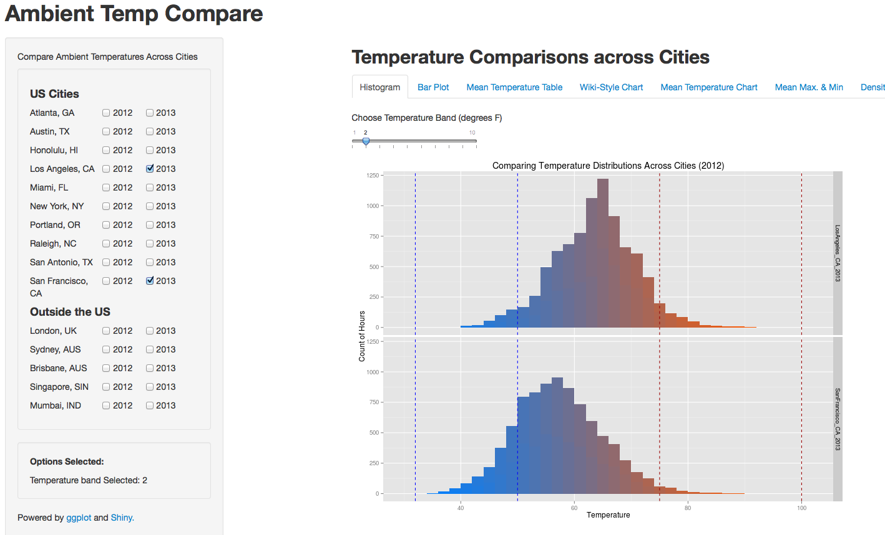

weatherCompare
===========
  
**weatherCompare** is a Shiny app that compares ambient temperature distributions across cities.

### The webApp URL
You can see what the app looks like here: [http://spark.rstudio.com/ram/WeatherCompare/](http://spark.rstudio.com/ram/WeatherCompare/)



Select a few cities and see how their historical temperatures stack up.

### Getting the Weather Data

The WebApp gets all the weather data (historical) from [weatherUnderground](http://weatherunderground.com)

If you'd like to get the weatherData for any city of your choice, you can use the functions in [weatherData package](https://github.com/Ram-N/weatherData) here.

#### Plotting

All of the plotting is done using `ggplot` and with liberal use of `facet_grid`


### To run this app locally you will need: 

1. ui.R
2. server.R
3. The `wxdata` directory and all the files inside it.

#### Commands
```
library(shiny)
runApp("WeatherCompare")
```

